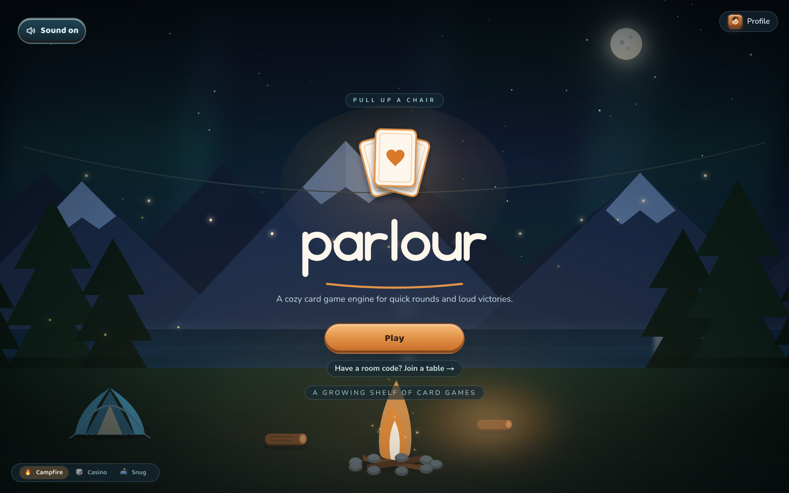
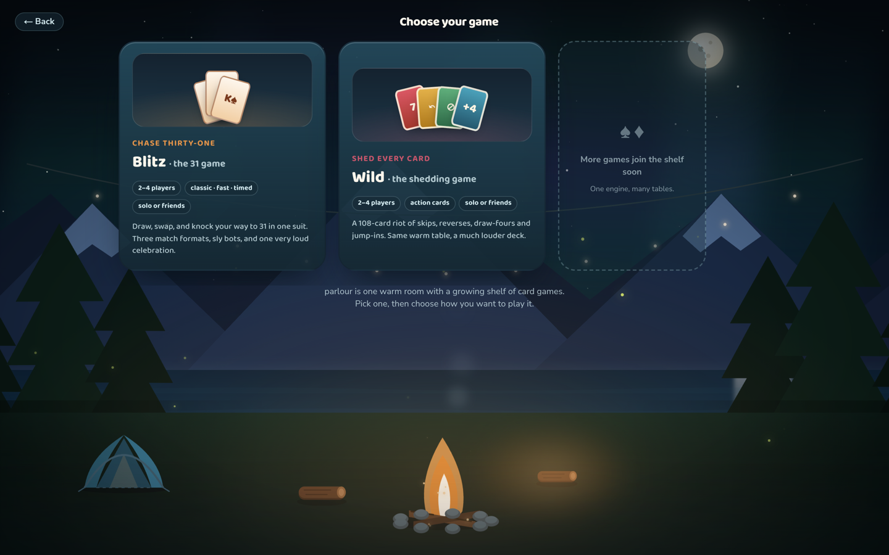
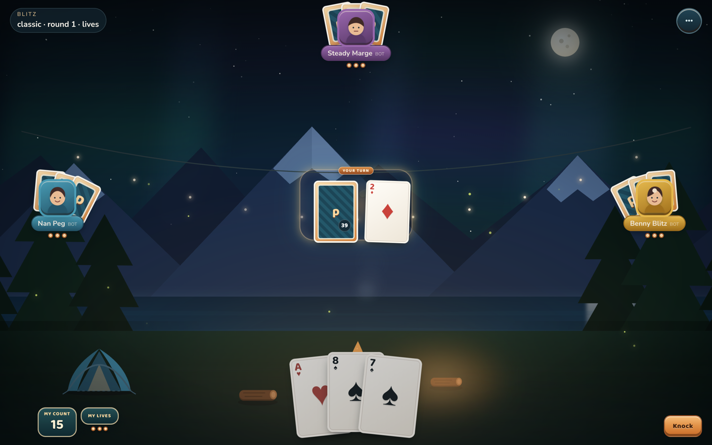
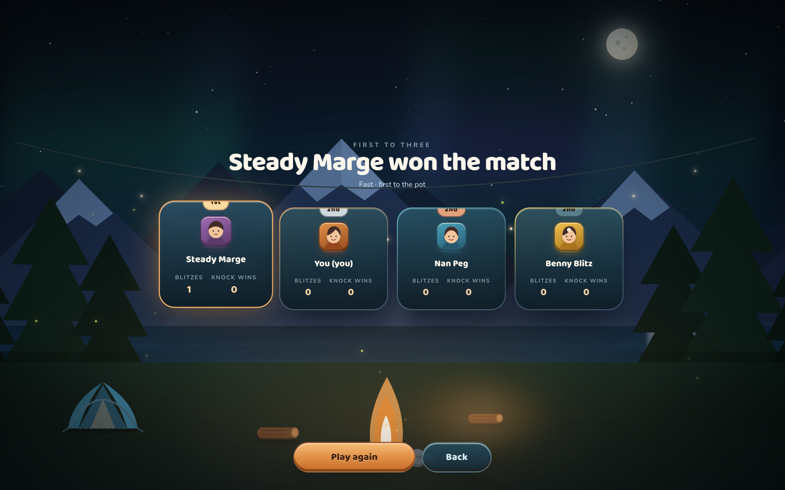
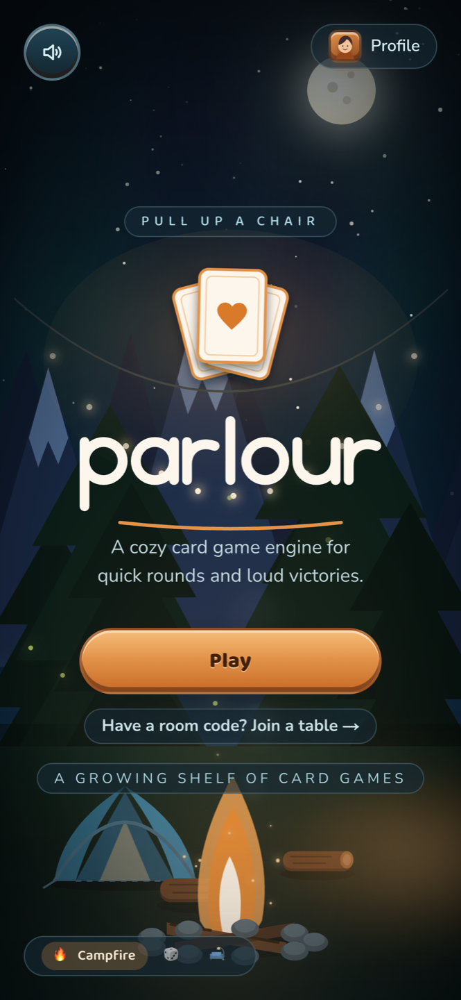
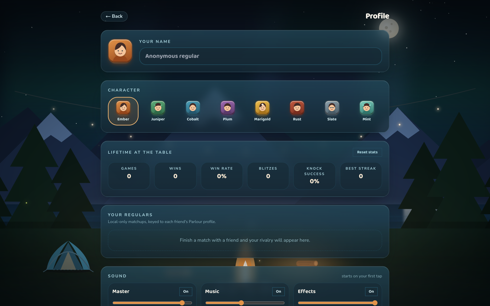

<div align="center">


### Cozy card games that open in a tab and deal you in.

**Blitz (31)** and **Wild** — solo against bots, or with friends on a four-letter room code.
No accounts. No servers. No install. Just pull up a chair.

[](https://parlour-liart.vercel.app)

[](LICENSE)
[](https://www.typescriptlang.org/)
[](https://nextjs.org/)
[](#play-with-friends-no-signup-no-server)
[](#why-there-is-no-server)

[Play now](https://parlour-liart.vercel.app) · [The games](#the-games) · [Multiplayer](#play-with-friends-no-signup-no-server) · [Under the hood](#under-the-hood) · [Run it locally](#run-it-locally)

</div>



---

## Pull up a chair

Most online card games want an account, a lobby, a launcher, and thirty seconds of your life before a single card moves. parlour wants none of that.

Open the link. Pick a game. You are playing. Want a friend in? Hit **Create Room**, send them four letters, and the table fills — peer to peer, straight browser to browser, with nothing in the middle.

It is warm, it is fast, and every card that moves does so because the rules engine said it did.



## The games

### Blitz · the 31 game

Draw, swap, and knock your way to 31 in one suit. Knock too early and you hand the round away; chase the perfect 31 and someone else knocks first. Three match formats, six bot personalities, and one very loud celebration.

| Mode        | Shape                                                     |
| ----------- | --------------------------------------------------------- |
| **Classic** | 3 lives each, last one standing, ~5–10 min                |
| **Fast**    | First to 3 round wins, no eliminations, ~2–4 min          |
| **Timed**   | 3:00 match clock, 7-second turn timers, sudden-death ties |



### Wild · the shedding game

A 108-card riot of skips, reverses, draw-fours, and jump-ins. Same warm table, much louder deck. **Classic** plays it by the book; **Party** turns on draw-stacking and lets anyone slam an exact match down out of turn.

Playable cards lift and light up. Everything else dims. You never have to guess what is legal.


### Every match ends on a podium



## Play with friends, no signup, no server

1. **Create Room** — you get a four-character code from an unambiguous alphabet (no `0`/`O`, no `1`/`I`).
2. Send it. Your friend types it in, or opens your share link.
3. Play.

Under that: **Nostr relays for signaling only**, then a **WebRTC data-channel mesh** carrying the actual game. The host is authoritative, and the table survives real life:

- **Host election** — if the host closes their laptop, the table picks a new one and play continues.
- **Bot takeover** — a seat that drops gets played by a bot until its human comes back.
- **Rejoin** — reconnecting replays the event log and you land exactly where you left off.

No game server exists. There is nothing to sign up for and nothing to leak, because there is no account and no database.

> **Honest about the crypto:** hidden-hand redaction here is _honest UI_, not cryptography — the same trust model as playing cards at a kitchen table. That is the right call for friends play. A mental-poker upgrade path is designed but not shipped.

## Under the hood

parlour is really a **card-game engine** with two games sitting on top of it.

**The engine is pure.** No React, no DOM, no network, no `Date.now()`, no `Math.random()`. Randomness comes only from a seeded RNG. ESLint enforces every one of those rules.

```
state = replay(seed, eventLog)
```

That single line buys everything else: replays, reconnect, host migration, spectating, and multiplayer peers that cannot silently disagree. Same seed plus same events means byte-identical state on every machine.

- **Moves are pure reducers** that emit an ordered **fx timeline**. The UI animates _only_ from fx events — it never diffs state to guess what happened. That is why the deal cascades card by card and the flights arc instead of teleporting.
- **Simultaneous phases and single-seat turns share one reducer path**, so a jump-in interrupt and a normal turn are the same kind of thing to the engine.
- **`MatchDef` composes rounds** into lives, cumulative scores, dealer rotation, match clocks, and sudden death — without any game knowing how a match is shaped.
- **Adding a game means writing a rules module**, not touching the engine. Wild was built entirely against the public engine API and required zero engine changes to prove it.

### The bots are tested like a game, not like a function

Blitz ships a headless simulator that plays **10,000 games per gate** and fails the build if the bot ladder stops making sense:

```
gate 1 — Hard vs Easy head-to-head
  hard 73.3% vs easy 26.7% over 10000 games — PASS

gate 2 — persona win-rate band in 4-seat mixed games
  rookie-roo 20.7% · poker-pat 22.4% · knuckles 24.0%
  benny-blitz 25.3% · steady-marge 26.4% · nan-peg 31.2% — PASS
```

Six personalities that feel different, none of them a punching bag, none of them unbeatable.

### Why there is no server

The whole app is a **static export**. It builds to a folder of files and sits on a CDN. Solo play works offline. Multiplayer borrows public relays for a handshake and then talks directly between browsers.

There is no backend to run, to scale, to pay for, or to breach.

## It is a phone game too

Installable PWA, offline-capable, and laid out for one thumb.

<div align="center">

</div>

## Your table, your regulars

No account, but not anonymous either. Everything lives in your browser: a name, a character, lifetime stats, and a running head-to-head record against every friend you have played.



## Run it locally

```bash
pnpm install
pnpm dev                      # Next dev server
pnpm -r test                  # vitest across every package
pnpm -r build                 # typecheck + build everything
pnpm sim -- --games 10000     # headless Blitz bot simulation
```

Built and CI-gated against Node 26 and pnpm 10.

## Repo layout

```
parlour/
  packages/
    engine/          # pure, deterministic, transport-agnostic core
    game-blitz/      # 31 rules module + bot personalities + simulator
    game-wildpile/   # the Wild rules module
  apps/
    web/             # the app — Next.js, static export
```

## Roadmap

- [x] Deterministic engine + Blitz rules, gated by a 10,000-game headless simulation
- [x] The feel milestone — fx-driven animation, art, audio, celebrations
- [x] Local profiles, lifetime stats, friend head-to-head history, PWA
- [x] P2P multiplayer — room codes, share links, host election, bot takeover, rejoin
- [x] Wild — second game, built entirely on the public engine API
- [ ] More games on the shelf. One engine, many tables.

## License

MIT — see [LICENSE](LICENSE).

<div align="center">

**[Pull up a chair →](https://parlour-liart.vercel.app)**

</div>
