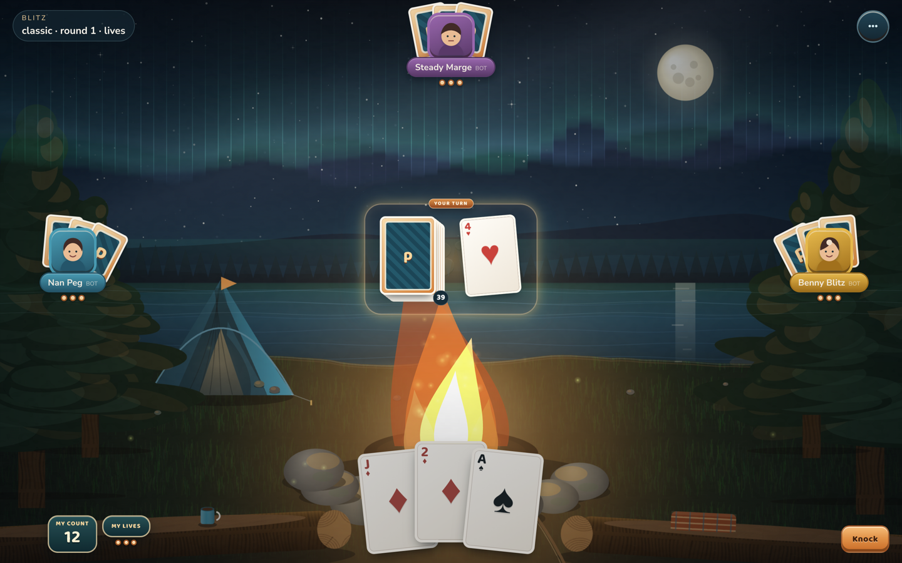
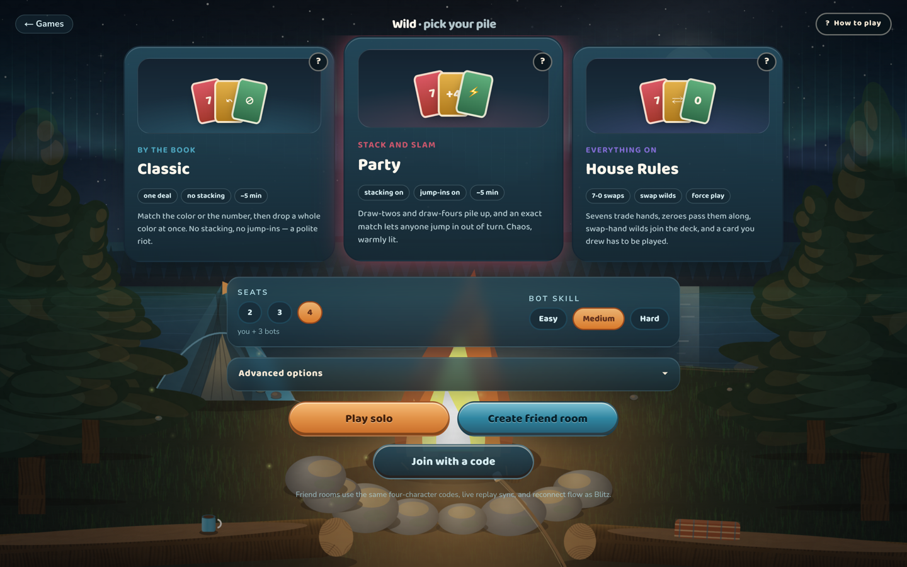
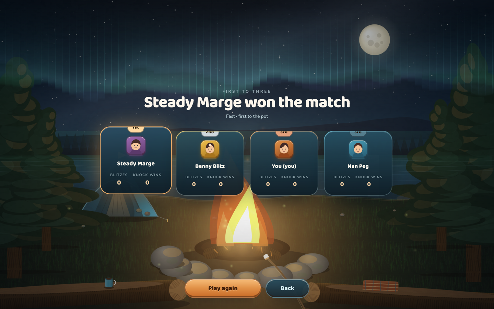
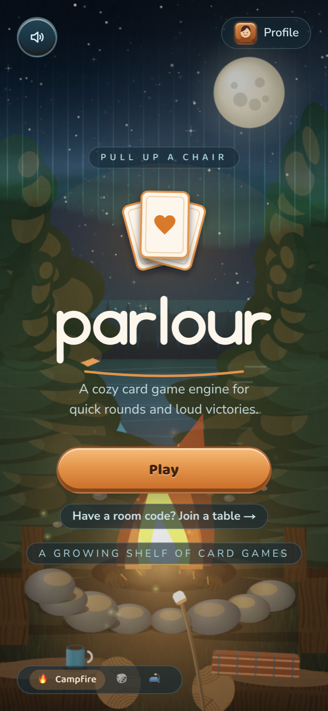

<div align="center">


### A deterministic card-game engine — and the cozy table it deals on.

One pure TypeScript engine. A growing shelf of card games on top of it.
Solo against bots or with friends on a four-letter room code — no accounts and no game server.

[](https://parlour-liart.vercel.app)
[](https://github.com/braedonsaunders/parlour/releases/latest)

[](LICENSE)
[](https://www.typescriptlang.org/)
[](https://nextjs.org/)
[](#multiplayer-comes-with-the-engine)
[](#why-there-is-no-server)

[Play now](https://parlour-liart.vercel.app) · [Install](#install-parlour) · [The engine](#one-engine-many-tables) · [The shelf](#the-shelf) · [Multiplayer](#multiplayer-comes-with-the-engine) · [Add a game](#adding-a-game) · [Run it locally](#run-it-locally)

</div>


---

## Install Parlour

The web app remains the fastest way in, and Vercel stays useful for production and preview URLs. It is not a runtime dependency: the same static export is also packaged into native desktop apps. Packaged room links use the replaceable `PARLOUR_SHARE_ORIGIN` GitHub Actions variable, so releases can point at any HTTPS static host.

- **iPhone and iPad:** open the web app in Safari, tap **Add to Home Screen** in Parlour, then use **Share → Add to Home Screen**.
- **Android:** tap Parlour's **Install app** button and accept the browser's install prompt.
- **macOS, Windows, and Linux:** download the installer for your platform from the [latest GitHub Release](https://github.com/braedonsaunders/parlour/releases/latest).

Desktop builds are not code-signed yet, so macOS and Windows may show an unfamiliar-developer warning. Release artifacts are built directly from tagged source by GitHub Actions.

## One engine, many tables

parlour is a card-game engine first. The app you can play is the proof that it works.

**The engine is pure.** No React, no DOM, no network, no `Date.now()`, no `Math.random()`. Randomness comes only from a seeded RNG, and ESLint fails the build if anything sneaks in.

```
state = replay(seed, eventLog)
```

That one line pays for everything downstream. Same seed plus the same events means byte-identical state on every machine, so replays, reconnects, host migration, spectating, and desync-proof multiplayer all fall out of the design instead of being bolted on.

- **Moves are pure reducers** that emit an ordered **fx timeline**. The UI animates _only_ from fx events — it never diffs state to guess what happened. That is why deals cascade card by card and cards arc between piles instead of teleporting.
- **Simultaneous phases and single-seat turns share one reducer path.** A slap window, a jump-in interrupt, and an ordinary turn are all the same kind of thing to the engine — which is how a real-time slapping game and a patient trick-taker live under one runtime.
- **`MatchDef` composes rounds** into lives, cumulative scores, dealer rotation, match clocks, and sudden death, without any game needing to know how a match is shaped.
- **Veiled decks are supported at the engine layer.** A veiled room deals opaque handles instead of card faces; reveals record their `(handle, card)` mapping in the log so replay still reproduces the round exactly.
- **Games are packages, not engine branches.** Every game on the shelf was written against the public engine API.

### What a new game gets for free

Write a rules module, add one registry entry and one table pack, and you inherit the rest. A game is no longer a branch in four different `switch` statements — the room registry (`lib/games/roomRegistry.ts`) answers every question a friend room asks about a game, and `GameTablePage` runs the table itself.

|                    |                                                           |
| ------------------ | --------------------------------------------------------- |
| 🎬 **Animation**   | fx timeline → deal cascades, card flights, arrival glints |
| 🤖 **Bots**        | seat-fillable bot policies with difficulty tiers          |
| 🌐 **Multiplayer** | room codes, WebRTC mesh, host authority, rejoin           |
| ⏪ **Replay**      | deterministic log replay for reconnect, spectate, debug   |
| 🏆 **Matches**     | lives, scores, clocks, sudden death, podium celebration   |
| 🔊 **Audio**       | per-game SFX pack keyed to your fx events                 |
| 📖 **How to play** | structured rules doc rendered by the in-app help modal    |
| 📊 **Stats**       | lifetime records and friend head-to-head, stored locally  |

## The shelf


| Game                         | What it is                                                                                     | Status       |
| ---------------------------- | ---------------------------------------------------------------------------------------------- | ------------ |
| **Blitz** · the 31 game      | Draw, swap, and knock your way to 31 in one suit. Classic, Fast, and Timed formats.            | **Playable** |
| **Wild** · the shedding game | 112 cards of skips, draw-fours, color dumps, and jump-ins. Classic or Party house rules.       | **Playable** |
| **Egyptian Ratscrew**        | Flip, challenge on face cards, and slap doubles and sandwiches inside a real-time slap window. | **Playable** |
| **Gin Rummy**                | Meld, knock, go gin — and undercut the player who knocked too soon.                            | **Playable** |
| **Hearts**                   | Pass three, dodge the Queen, break hearts, or shoot the moon.                                  | **Playable** |
| **Euchre**                   | Order it up, name trump, go alone, and march the hand.                                         | **Playable** |
| **Cribbage**                 | Peg the board, count the show, and try not to get skunked.                                     | **Playable** |
| **President**                | Slam sets, clear the pile, and trade cards between President and Scum.                         | **Playable** |

### Blitz · the 31 game

Knock too early and you hand the round away; chase the perfect 31 and someone else knocks first. Six bot personalities, three formats, one very loud celebration.

| Mode        | Shape                                                     |
| ----------- | --------------------------------------------------------- |
| **Classic** | 3 lives each, last one standing, ~5–10 min                |
| **Fast**    | First to 3 round wins, no eliminations, ~2–4 min          |
| **Timed**   | 3:00 match clock, 7-second turn timers, sudden-death ties |



### Wild · the shedding game

Same warm table, much louder deck. **Classic** plays it by the book; **Party** turns on draw-stacking and lets anyone slam an exact match down out of turn.



Playable cards lift and light up. Everything else dims. You never have to guess what is legal.


### Every match ends on a podium



## Multiplayer comes with the engine

1. **Create Room** — you get a four-character code from an unambiguous alphabet (no `0`/`O`, no `1`/`I`).
2. Send it. Your friend types it in, or opens your share link.
3. Play.

Under that: **Nostr relays for signaling only**, then a **WebRTC data-channel mesh** carrying the game itself. The host is authoritative, and because every peer can replay the log, the table survives real life:

- **Host election** — if the host closes their laptop, the table picks a new one and play continues.
- **Bot takeover** — a seat that drops gets played by a bot until its human comes back.
- **Rejoin** — reconnecting replays the event log and you land exactly where you left off.

No game server exists. Nothing to sign up for and nothing to leak, because there is no account and no database.

> **Honest about the crypto:** in an ordinary room, hidden hands are _honest UI_ — the same trust model as playing cards at a kitchen table, which is the right call for friends play. The engine now carries the veiled-deck primitives for rooms that want more; the cryptographic reveal layer lives in the transport, not the rules.

> **Honest about the hash:** every event carries a state hash, and it is a **desync detector, not a tamper detector**. It reliably catches two honest peers whose state drifted apart; it is trivially recomputed by a peer that doctored its own log. When the question is "did the authority cheat" rather than "did we drift", replay with `verifyLog` — it re-runs legality and validation for every logged action and names the first one a rules-abiding host could not have produced.

> **Honest about the relay:** most players connect peer to peer over STUN. Symmetric NATs cannot, and those pairs need a TURN relay to carry the traffic. parlour ships with a free, shared, public relay as its default. Your cards stay private from it — the data channel is DTLS-encrypted end to end, and a veiled room is encrypted again on top — but its _availability_ is nobody's promise. Point `NEXT_PUBLIC_PARLOUR_TURN_URLS` (with `_USERNAME` and `_CREDENTIAL`) at your own relay and the bundled one is replaced rather than kept as a fallback. See [`iceServers.ts`](apps/web/src/lib/multiplayer/iceServers.ts).

## The bots are tested like a game, not like a function

Blitz ships a headless simulator whose **full ladder is 10,000 games per gate**. CI runs a smaller deterministic sample so the rest of the monorepo still gets tested; `pnpm sim -- --games 10000` is the complete check:

```
gate 1 — Hard vs Easy head-to-head
  hard 73.3% vs easy 26.7% over 10000 games — PASS

gate 2 — persona win-rate band in 4-seat mixed games
  rookie-roo 20.7% · poker-pat 22.4% · knuckles 24.0%
  benny-blitz 25.3% · steady-marge 26.4% · nan-peg 31.2% — PASS
```

Six personalities that feel different, none of them a punching bag, none of them unbeatable.

## Why there is no server

The whole app is a **static export**. It builds to a folder of files and sits on a CDN. Solo play works offline. Multiplayer borrows public relays for a handshake and then talks directly between browsers.

There is no backend to run, to scale, to pay for, or to breach.

## Adding a game

A game is one package exporting one object. The engine handles the rest.

```ts
export const myGame: GameDef<MyState, MyConfig> = {
  id: 'mygame',
  configSchema, // rule toggles + named presets the UI renders for you
  howToPlay, // structured rules doc for the in-app help modal
  setup: ({ config, seats, rng }) => initialState(config, seats, rng),
  moves: {
    playCard: {
      validate: (state, seat, payload) =>
        isLegal(state, seat, payload) ? true : { code: 'illegal-card', message: 'not playable' },
      apply: (state, seat, payload, ctx) => {
        ctx.fx.emit('card.move', { from: 'hand', to: 'pile' });
        return next(state, seat, payload);
      },
    },
  },
  flow, // whose turn, and when a round ends
  playerView: (state, seat) => redactOtherHands(state, seat),
  end: (state) => (finished(state) ? result(state) : null),
  bots: [easy, medium, hard],
};
```

No engine changes, no forked runtime. Wild, Ratscrew, and everything after them were built exactly this way.

## It is a phone game too

Installable PWA, offline-capable, and laid out for one thumb.

<div align="center">

</div>

## Your table, your regulars

No account, but not anonymous either. Everything lives in your browser: a name, a character, lifetime stats, and a running head-to-head record against every friend you have played.


## Run it locally

```bash
pnpm install
pnpm dev                      # Next dev server
pnpm desktop:dev              # Tauri shell + Next dev server
pnpm desktop:build            # native installer for this platform
pnpm -r test                  # vitest across every package
pnpm -r build                 # typecheck + build everything
pnpm sim -- --games 10000     # headless Blitz bot simulation
```

Built and CI-gated against Node 26 and pnpm 10.

## Repo layout

```
parlour/
  packages/
    engine/          # pure, deterministic, transport-agnostic core
    game-blitz/      # 31 rules + bot personalities + simulator
    game-wildpile/   # the Wild rules module
    game-ratscrew/   # Egyptian Ratscrew, slap windows and all
  apps/
    web/             # the app — Next.js, static export
    desktop/         # thin Tauri shell around that same export
```

## Roadmap

- [x] Deterministic engine, gated by a 10,000-game headless simulation
- [x] The feel milestone — fx-driven animation, art, audio, celebrations
- [x] Local profiles, lifetime stats, friend head-to-head history, PWA
- [x] P2P multiplayer — room codes, share links, host election, bot takeover, rejoin
- [x] Installable PWA and native macOS, Windows, and Linux releases
- [x] Second and third games built entirely on the public engine API
- [x] Veiled-deck primitives in the engine
- [x] The rest of the first shelf: Gin, Hearts, Euchre, Cribbage, President, Ratscrew
- [ ] Platform paydown — shared table shell, room registry, CI that does not bail on the first package
- [ ] Next titles (not this wave): Spades, then daily-seeded Klondike/FreeCell, then Spite & Malice

## License

MIT — see [LICENSE](LICENSE).

<div align="center">

**[Pull up a chair →](https://parlour-liart.vercel.app)**

</div>
