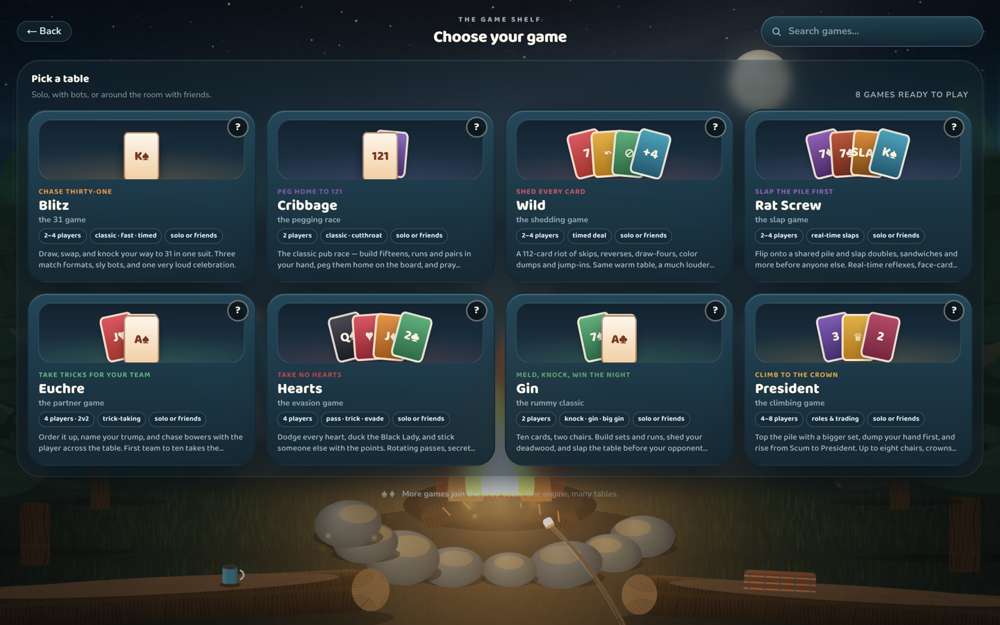
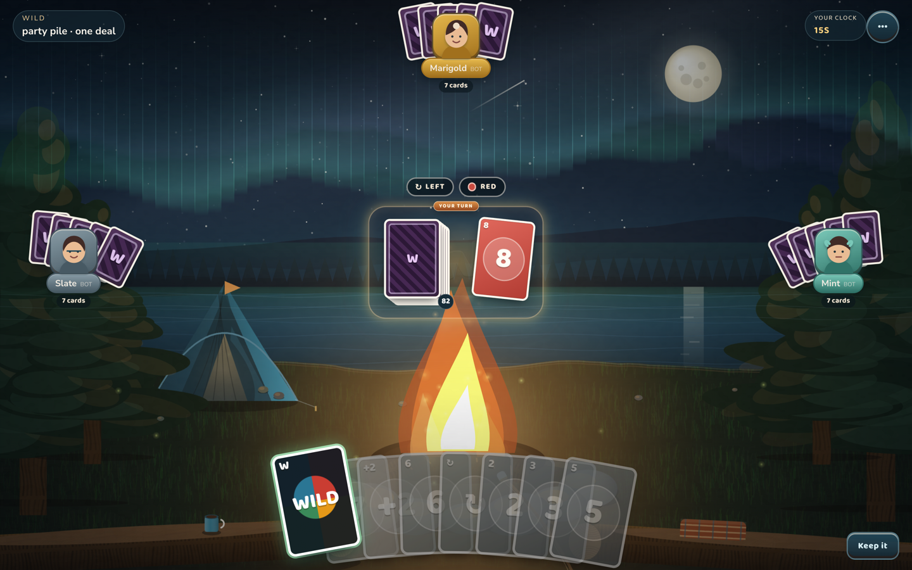

<div align="center">


### Nineteen card games. One cozy table. Your friends join with four letters.

No account. No download. No server. Send a room code and you're dealing in seconds —
on your phone, your laptop, or a native desktop app.

[](https://parlour-liart.vercel.app)
[](https://github.com/braedonsaunders/parlour/releases/latest)
[](LICENSE)
[](#play-with-friends-in-about-thirty-seconds)
[](#privacy--trust)

</div>


---

## Play with friends in about thirty seconds

1. **Create a room.** You get a four-character code — or a link you can paste into any chat.
2. **Send it.** Your friend types the code or taps the link. Any browser, any device, nothing to install.
3. **Play.**

That's the whole ceremony. Under the hood the table is peer-to-peer, so there is no game
server to lag, no account to create, and nothing stored about you. Real life is handled too:

- Someone's phone dies mid-hand? **A bot takes their seat** until they rejoin.
- The host closes their laptop? **The table elects a new host** and keeps dealing.
- Dropped connection? **Rejoin with the same code** and land exactly where you left off.

## The shelf — nineteen games, all playable



| Game                                | The pitch                                                                                 |
| ----------------------------------- | ----------------------------------------------------------------------------------------- |
| **Blitz** · the 31 game             | Knock your way to 31 in one suit. Three formats, six bot personalities.                   |
| **Wild** · the shedding game        | Skips, draw-fours, color dumps and jump-ins. Classic rules or the loud Party house rules. |
| **Crazy Eights**                    | Match suit or rank, eights call the suit, losers pay for what they're still holding.      |
| **Egyptian Ratscrew**               | Flip, challenge the face cards, and slap the sandwich — in real time.                     |
| **Gin Rummy**                       | Meld, knock, go gin — and undercut whoever knocked too soon.                              |
| **Hearts**                          | Pass three, dodge the Queen, break hearts, or shoot the moon.                             |
| **Euchre**                          | Order it up, name trump, go alone, march the hand.                                        |
| **Cribbage**                        | Peg the board, count the show, try not to get skunked.                                    |
| **President**                       | Slam sets, clear the pile, trade cards with the Scum.                                     |
| **Poker** · no-limit hold'em        | Blinds climb until one stack has the lot. Chips only.                                     |
| **Oh Hell**                         | Bid exactly the tricks you'll take. The hand grows, then shrinks back down.               |
| **Scopa**                           | Fish cards off the table by matching one — or the sum of several.                         |
| **Spite & Malice**                  | Race to empty your payoff pile and bury what your neighbour needs.                        |
| **Spades**                          | Bid books with a partner, break spades, mind the bags.                                    |
| **Klondike**                        | The solitaire everyone knows, dealt from a seed you can share.                            |
| **Freecell** · the open solitaire   | Every card face-up from the deal — four free cells, no luck but the shuffle.              |
| **Spider** · the two-deck solitaire | Peel eight suited runs off 104 cards before the table buries you.                         |
| **Pyramid** · pair to thirteen      | Pair cards that sum to thirteen and topple the pyramid one match at a time.               |
| **Golf** · the fast solitaire       | Play ±1 onto the hole and clear the grass in as few passes as you can.                    |

House rules are real settings, not forks: every game ships rule toggles and named presets you can set
when you create the room.

## It feels like a real game, not a web page

- **Legal plays light up.** Playable cards lift and glow; everything else dims. You never guess what's legal.
- **Cards travel.** Deals cascade card by card, cards arc between piles, knock wins land with a celebration — nothing teleports.
- **Every match ends on a podium.** Losers can demand a rematch from it.
- **Sound on by default, mute any channel.** Per-table SFX and an ambient score that never gets in the way.



## Solo play that actually fights back

Six named Blitz personalities — rookie-roo to nan-peg — each tuned on a **10,000-game simulation**
so the ladder is fair: the easy bot is beatable, the hard bot earns its name, and nobody is a punching bag.
Everything solo runs **fully offline** — airplane mode is a supported way to play.

## Install it, or don't

The browser version is the full game. If you want it closer:

- **iPhone / iPad** — open the web app, tap **Add to Home Screen**, then **Share → Add to Home Screen**.
- **Android** — tap the in-app **Install app** button.
- **macOS, Windows, Linux** — grab the installer from the [latest release](https://github.com/braedonsaunders/parlour/releases/latest).
- **Linux AppImage / `.deb`** — the shell already turns off WebKitGTK's DMA-BUF compositor so NVIDIA, Hyprland, and GPU-less VMs do not paint then quit. If it still dies, start it with `WEBKIT_DISABLE_COMPOSITING_MODE=1`.

## Privacy & trust, honestly stated

There is no backend, no database, and no account — your profile, stats, and head-to-head
rivalries against friends live in your browser. In ordinary friend rooms, hidden hands are
hidden the same way they are around a kitchen table: honest UI. For tables that want more,
parlour carries **veiled-deck play**, where even the wire never sees your cards until you
reveal them. Multiplayer rides end-to-end-encrypted peer-to-peer channels.

One exception, named plainly: the hosted site loads **Vercel Analytics**, which records page
views and coarse request metadata (no cookies, no profile identifiers, nothing you type or
play). Your game itself never talks to it. The desktop apps and the static export carry none
of it — analytics is a property of the hosted URL, not of parlour.

The fine print (TURN relays, replay verification, exactly what "veiled" guarantees) lives in
the app and in the engine docs below.

## Your regulars, without the account

Pick a name and a character once. parlour keeps your **lifetime record and a rivalry history
against every friend you've played** — locally, on your device.


---

<div align="center">

**[Pull up a chair →](https://parlour-liart.vercel.app)**

</div>

---

## Under the hood: a deterministic card-game engine

parlour is an engine first; the app is proof it works. The core contract:

```
state = replay(seed, eventLog)
```

One pure TypeScript engine — no React, no DOM, no network, no `Math.random()` (ESLint fails the
build if any sneaks in). Same seed plus same events means byte-identical state on every machine.
**Replays, reconnects, host migration, desync detection, undo and cheat-auditing are wired in and
shipped.** Rejoin replays the log; peers compare state hashes and resync on drift; undo truncates
the log and replays what is left, so it lands on the exact earlier position rather than an
approximation of it.

Cheat-auditing is the one worth spelling out, because a friend room has no server. The host is
another player, so its packets are a claim about what the rules allowed rather than a fact.
Every guest re-checks each packet as it arrives — legality and validation for player moves, and
for the automatic events the runtime produces, a re-derivation of what `flow.advance` actually
owed. A packet that fails is refused and the guest pulls a fresh snapshot instead of playing on.
Verification is scoped to the tail a packet just added, so a peer checks each event once and the
cost sits inside the replay it was already doing.

The state hash is _not_ what does this. It is a 32-bit checksum for spotting drift between honest
peers, and anyone who can edit a log can recompute it — the engine says so at the definition.

Spectating is still not built.

- **Moves are pure reducers** that emit an ordered **fx timeline**. The UI animates _only_ from fx events — never by diffing state. That's why deals cascade and cards arc instead of teleporting.
- **Real-time and turn-based share one runtime.** A slap window, an out-of-turn jump-in, and an ordinary trick are all the same kind of move to the engine.
- **Veiled decks are an engine primitive.** The protocol deals opaque handles and records reveals in the log, backed by an SRA commutative cipher, threshold recovery for a dropped seat and a match-end audit. Friend rooms still play the open collaborative deal while the room layer is proven against it.
- **Games are packages, not engine branches.** Every game on the shelf was written against the public engine API.

| A new game inherits for free |                                                           |
| ---------------------------- | --------------------------------------------------------- |
| 🎬 Animation                 | fx timeline → deal cascades, card flights, arrival glints |
| 🤖 Bots                      | seat-fillable bot policies with difficulty tiers          |
| 🌐 Multiplayer               | room codes, WebRTC mesh, host authority, rejoin           |
| ⏪ Replay                    | deterministic log replay for reconnect and debug          |
| 🏆 Matches                   | lives, scores, clocks, sudden death, podium celebration   |
| 🔊 Audio                     | per-game SFX pack keyed to your fx events                 |
| 📖 Rules doc                 | structured help rendered by the in-app modal              |
| 📊 Stats                     | lifetime records and friend head-to-head, stored locally  |

### Add a game

A game is one package exporting one object. Rules module + one registry entry + one table pack,
and you inherit everything above.

```ts
export const myGame: GameDef<MyState, MyConfig> = {
  id: 'mygame',
  configSchema, // rule toggles + named presets the UI renders for you
  howToPlay, // structured rules doc for the in-app help modal
  setup: ({ config, seats, rng }) => initialState(config, seats, rng),
  moves: {
    playCard: {
      validate: (state, seat, payload) =>
        isLegal(state, seat, payload) ? true : { code: 'illegal-card', message: 'not playable' },
      apply: (state, seat, payload, ctx) => {
        ctx.fx.emit('card.move', { from: 'hand', to: 'pile' });
        return next(state, seat, payload);
      },
    },
  },
  flow, // whose turn, and when a round ends
  playerView: (state, seat) => redactOtherHands(state, seat),
  end: (state) => (finished(state) ? result(state) : null),
  bots: [easy, medium, hard],
};
```

### The bots are tested like a game, not like a function

A headless simulator gates every bot change: **Hard must beat Easy head-to-head over 10,000 games**,
and every persona must land inside its win-rate band in mixed tables. Personalities that feel
different, none of them a punching bag, none of them unbeatable.

## Run it locally

```bash
pnpm install
pnpm dev                      # Next dev server
pnpm desktop:dev              # Tauri shell + Next dev server
pnpm desktop:build            # native installer for this platform
pnpm -r test                  # vitest across every package
pnpm -r build                 # typecheck + build everything
pnpm sim -- --games 10000     # headless bot simulation
```

## Repo layout

```
parlour/
  packages/
    engine/          # pure, deterministic, transport-agnostic core
    tricks/          # shared trick-taking primitives
    game-*/          # one package per game: rules + bots + sim gates
  apps/
    web/             # the app — Next.js, static export
    desktop/         # thin Tauri shell around that same export
```

## License

MIT — see [LICENSE](LICENSE). If parlour is your table now, **leave a star** — it's how other
card players find it.

<div align="center">

**[Pull up a chair →](https://parlour-liart.vercel.app)**

</div>
